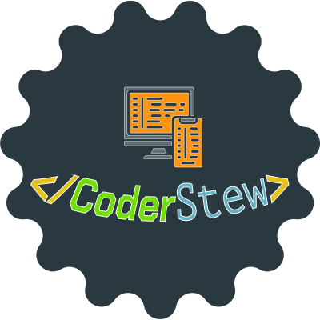

# CoderStew LLC - Professional Website

<p align="center">
  
</p>

<p align="center">
  <strong>Modern, responsive website for professional programming and IT services</strong>
</p>

<p align="center">
  
  
  
  
  
</p>

---

## Overview

CoderStew LLC is a modern, fully-featured website built for showcasing professional programming and IT services. The platform combines elegant design with robust functionality to provide an exceptional user experience while maintaining enterprise-level performance and security standards.

### 🎯 Purpose
- **Professional Presence**: Establish credibility in the freelance programming market
- **Client Acquisition**: Streamlined contact system for project inquiries
- **Service Showcase**: Comprehensive presentation of technical capabilities
- **Performance**: Optimized for speed, SEO, and user engagement

### ✨ Key Features

#### Frontend Experience
- **Modern Design**: Clean, professional interface with custom brand identity
- **Responsive Layout**: Mobile-first design ensuring perfect display across all devices
- **Single Page Application**: Smooth navigation with Vue.js routing
- **Performance Optimized**: Service worker caching, lazy loading, and optimized assets

#### Business Functionality
- **Contact Management**: Professional inquiry form with validation and email notifications
- **Service Presentation**: Dynamic showcase of programming and IT services
- **Portfolio Display**: Project examples with technology highlights
- **Content Management**: API-driven content updates for easy maintenance

#### Technical Excellence
- **SEO Optimized**: Meta tags, structured data, and search engine friendly URLs
- **Analytics Integration**: Google Analytics 4 with custom event tracking
- **Security First**: Rate limiting, CSRF protection, and security headers
- **Monitoring**: Health checks, error tracking, and performance metrics

---

## Technology Stack

### Backend Framework
- **Laravel 11.0+** - Modern PHP framework with elegant syntax
- **PHP 8.2+** - Latest PHP features and performance improvements
- **MySQL 8.0+** - Reliable relational database with Eloquent ORM

### Frontend Technologies
- **Vue.js 3.0+** - Progressive JavaScript framework with Composition API
- **Vite** - Fast build tool with hot module replacement
- **TailwindCSS 4.0+** - Utility-first CSS framework for rapid UI development

### Development Tools
- **Vitest** - Fast unit testing framework (197 tests passing)
- **NPM** - Package management with Node.js 22 LTS
- **Git** - Version control with structured commit messages

### Production Features
- **Service Worker** - Offline functionality and asset caching
- **SSL/TLS** - Secure HTTPS connections with security headers
- **Monitoring** - Health checks and performance metrics
- **Backup System** - Automated database and file backups

---

## Architecture

### Directory Structure
```
├── app/
│   ├── Console/Commands/      # Custom Artisan commands
│   ├── Http/Controllers/      # API and web controllers
│   ├── Http/Middleware/       # Custom middleware
│   ├── Models/               # Eloquent models
│   └── Helpers/              # Utility classes
├── resources/
│   ├── js/
│   │   ├── components/       # Vue.js components
│   │   ├── views/           # Page-level components
│   │   ├── services/        # API and utility services
│   │   └── router/          # Vue Router configuration
│   ├── css/                 # Stylesheets and Tailwind config
│   └── views/               # Blade templates
├── public/
│   ├── assets/              # Static assets (logo, images)
│   ├── images/              # Project portfolio images
│   └── sw.js                # Service worker
├── deployment/              # Production deployment files
└── tests/                   # Comprehensive test suite
```

### Key Components

#### Contact System
- **ContactForm.vue**: Feature-rich form with real-time validation
- **ContactController**: Laravel API with rate limiting and email notifications
- **ContactInquiry Model**: Database management with formatted attributes

#### Content Management
- **ContentController**: API for dynamic content updates
- **SEO Middleware**: Automatic meta tag generation
- **Health Monitoring**: System status and metrics endpoints

#### Performance Features
- **Service Worker**: Intelligent caching strategy
- **Image Optimization**: Responsive images with WebP support
- **Analytics Service**: Comprehensive user behavior tracking

---

## Getting Started

### Prerequisites
- PHP 8.2 or higher
- Node.js 22 LTS
- MySQL 8.0+ or SQLite (for development)
- Composer (PHP package manager)

### Installation

1. **Clone the repository**
   ```bash
   git clone https://github.com/your-username/coderstew-llc.git
   cd coderstew-llc
   ```

2. **Install PHP dependencies**
   ```bash
   composer install
   ```

3. **Install Node.js dependencies**
   ```bash
   npm install
   ```

4. **Environment setup**
   ```bash
   cp .env.example .env
   php artisan key:generate
   ```

5. **Database setup**
   ```bash
   php artisan migrate
   ```

6. **Build assets**
   ```bash
   npm run build
   ```

7. **Start development server**
   ```bash
   php artisan serve
   ```

Visit `http://localhost:8000` to view the application.

### Development Workflow

```bash
# Start development servers
npm run dev          # Frontend build with hot reload
php artisan serve    # Backend development server

# Run tests
npm test            # Frontend tests (Vitest)
php artisan test    # Backend tests (PHPUnit)

# Production build
npm run build       # Optimized production assets
```

---

## Deployment

### Production Deployment

The project includes comprehensive deployment tools:

1. **Deployment Script**: `./deployment/deploy.sh`
2. **Environment Template**: `.env.production`
3. **SSL Setup Guide**: `deployment/ssl-setup.md`
4. **Monitoring Guide**: `deployment/monitoring-setup.md`
5. **Deployment Checklist**: `deployment/DEPLOYMENT_CHECKLIST.md`

### Quick Deploy
```bash
# Make deployment script executable
chmod +x deployment/deploy.sh

# Run deployment
./deployment/deploy.sh
```

### Health Monitoring
- **Basic Health**: `/health`
- **Detailed Status**: `/health/detailed`
- **System Metrics**: `/health/metrics`

---

## Features Overview

### 🎨 User Interface
- **Professional Design**: Custom brand colors and typography
- **Mobile Responsive**: Optimized for all screen sizes
- **Accessibility**: ARIA labels and keyboard navigation
- **Performance**: < 3 second load times with caching

### 📧 Contact Management
- **Smart Forms**: 9-field contact form with validation
- **Email Notifications**: Professional HTML email templates
- **Rate Limiting**: Spam protection and security measures
- **Admin API**: Content management system

### 🔍 SEO & Analytics
- **Search Optimized**: Meta tags, structured data, sitemap
- **Google Analytics**: Event tracking and user behavior analysis
- **Social Media**: Open Graph and Twitter Card support
- **Performance**: Lighthouse optimization

### 🛡️ Security & Reliability
- **SSL/TLS**: Secure connections with security headers
- **Input Validation**: Client and server-side protection
- **Error Handling**: Graceful degradation and monitoring
- **Backup System**: Automated daily backups with notifications

---

## Testing

The project maintains comprehensive test coverage:

```bash
# Run all tests
npm test                    # 197 frontend tests
php artisan test           # Backend tests

# Test specific components
npm test ContactForm       # Contact form tests
npm test -- --coverage    # Coverage report
```

### Test Coverage
- **Frontend**: 197 tests covering all Vue components
- **Integration**: API endpoint testing
- **Performance**: Build optimization verification
- **Security**: Validation and authentication tests

---

## Performance

### Optimization Features
- **Asset Minification**: Terser for JavaScript, optimized CSS
- **Caching Strategy**: Service worker with intelligent cache management
- **Image Optimization**: Responsive images with modern formats
- **Code Splitting**: Vendor and UI library separation

### Performance Metrics
- **Build Size**: Optimized bundle splitting
- **Load Time**: < 3 seconds first contentful paint
- **Lighthouse Score**: Optimized for 90+ performance score
- **SEO Ready**: 100% search engine optimization

---

## Support & Maintenance

### Monitoring
- **Health Checks**: Automated system monitoring
- **Error Tracking**: Comprehensive logging and alerting
- **Performance Metrics**: Response time and resource usage
- **Backup Verification**: Daily backup integrity checks

### Content Management
- **API Updates**: Dynamic content modification
- **Service Management**: Easy service description updates
- **Portfolio Updates**: Simple project showcase management
- **SEO Control**: Meta tag and structured data management

---

## Contributing

### Development Standards
- **Code Style**: PSR-12 for PHP, ESLint for JavaScript
- **Testing**: Comprehensive test coverage required
- **Documentation**: Clear code comments and README updates
- **Security**: Security-first development approach

### Workflow
1. Fork the repository
2. Create a feature branch
3. Implement changes with tests
4. Submit pull request with description

---

## License

© 2025 CoderStew LLC. All rights reserved.

This project is proprietary software developed for CoderStew LLC's business operations. Unauthorized reproduction or distribution is prohibited.

---

## Contact

**CoderStew LLC**
- **Website**: [https://coderstew.com](https://coderstew.com)
- **Email**: [contact@coderstew.com](mailto:contact@coderstew.com)
- **Services**: Custom web applications, mobile development, IT consulting

---

<p align="center">
  <strong>Built with ❤️ for professional excellence</strong>
</p>